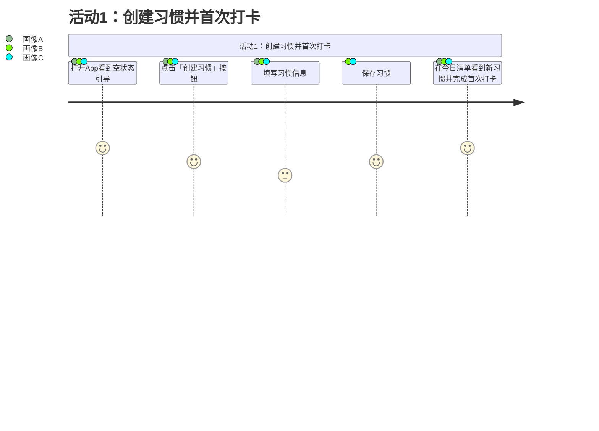
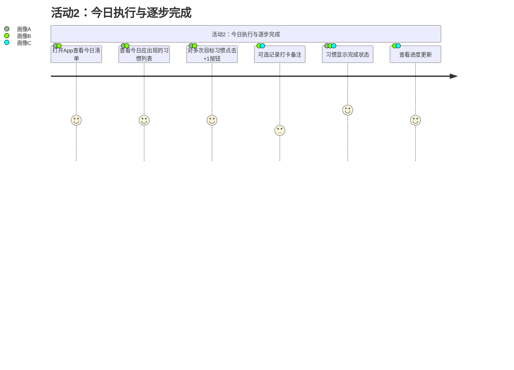
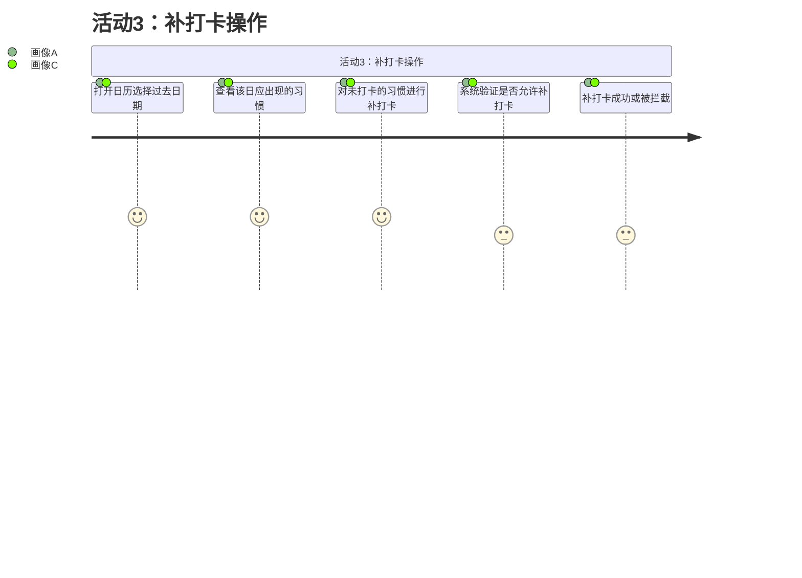
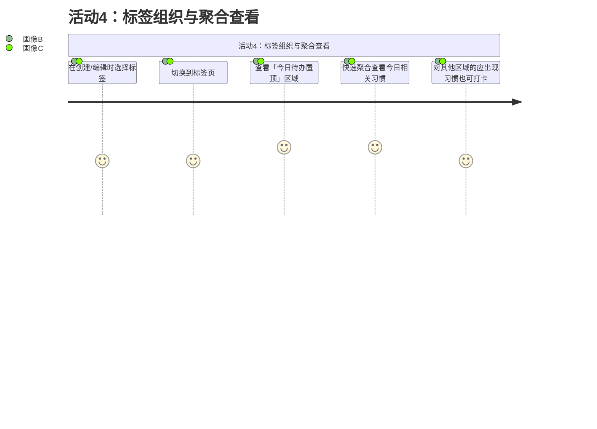
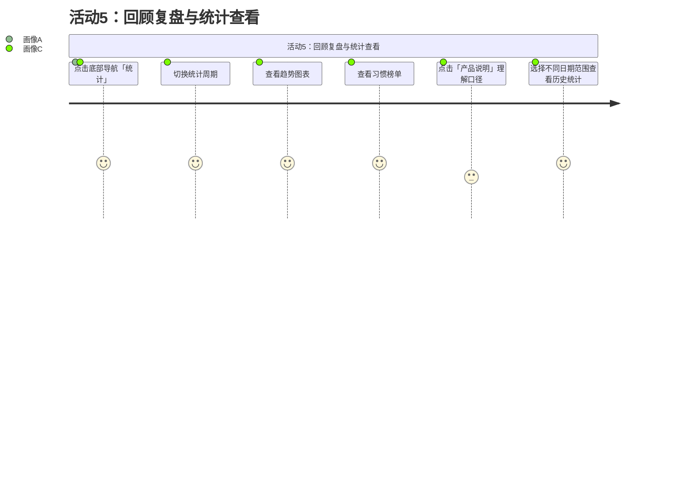
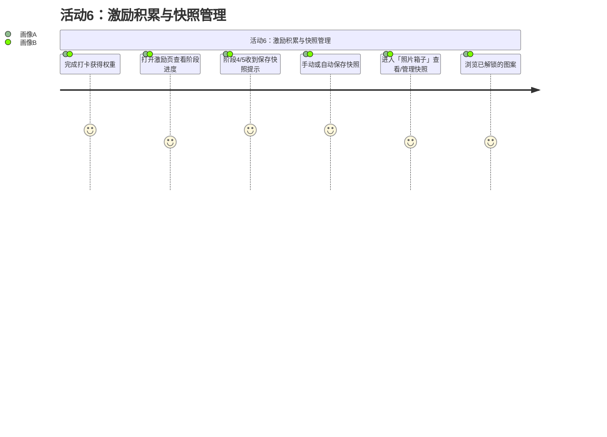
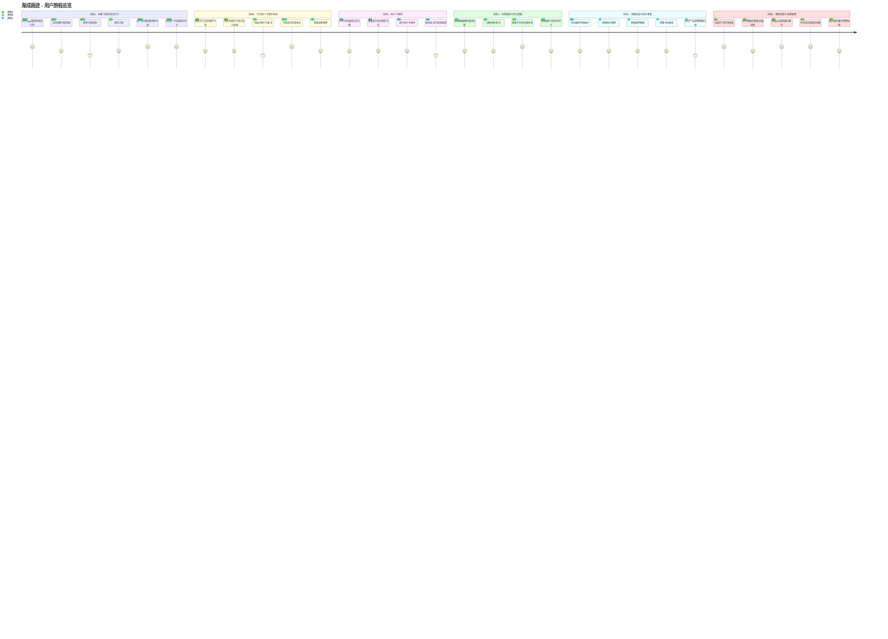
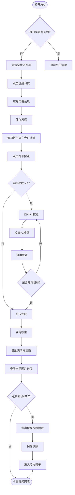
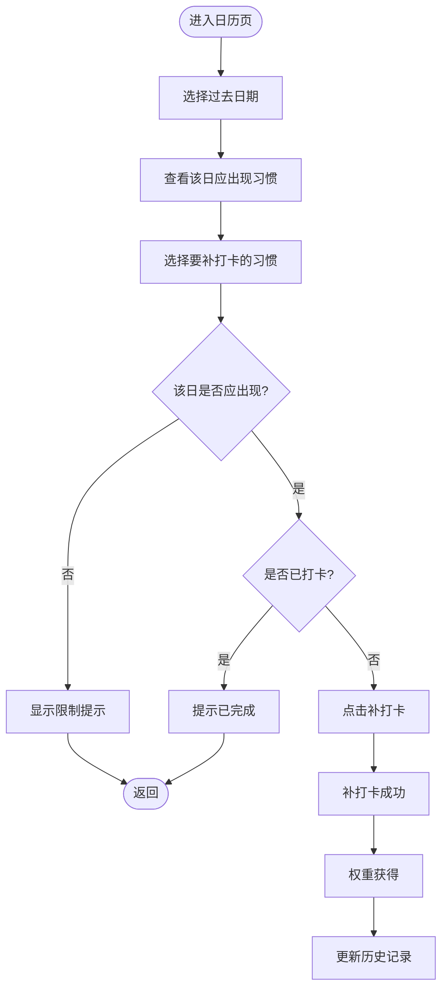
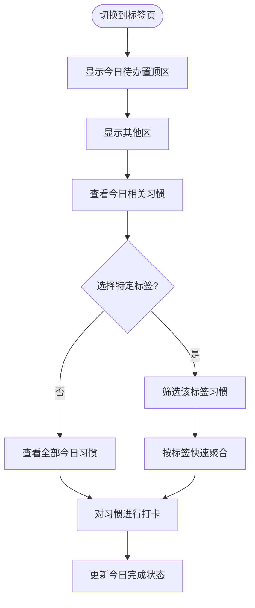

# 用户旅程图完整说明文档

版本：V2.0
基于：PRD-渐成画迹-P0.md
生成日期：2026-03-28

---

## 1. 概述

本文档为「渐成画迹」项目生成完整的用户旅程图，帮助团队理解用户在核心场景中的体验路径。旅程图包含：关键活动、具体行为、触点、情绪曲线（emoji）和痛点及其对应解决方案。

---

## 2. 用户画像

根据 PRD 2.1 节定义的三种用户画像：

| 画像 | 描述 | 核心诉求 |
|-----|------|---------|
| 画像A：轻量自律型 | 做得久，不追求复杂计划 | 「打开就做」，极简追踪 |
| 画像B：混合待办型 | 固定习惯 + 临时事项同时存在 | 统一清单管理 |
| 画像C：秩序掌控型 | 对顺序、分类、回顾有要求 | 排序稳定、口径透明 |

---

## 3. 关键活动与场景映射表

| 关键活动 | 对应场景 | 描述 |
|---------|---------|------|
| 活动1 | S1 | 创建习惯 → 今日出现 → 立刻打卡一次 |
| 活动2 | S2 | 今日执行 → 多次目标逐步完成 → 记录备注 → 当日完成 |
| 活动3 | S3 | 补打卡 → 只对过去日期且该日应出现的习惯允许计入 |
| 活动4 | S4 | 用标签组织 → 标签页「今日待办置顶」快速聚合 |
| 活动5 | S5 | 回顾复盘 → 统计页切换周期 → 看趋势/榜单 → 理解口径 |
| 活动6 | S6 | 激励沉淀 → 激励随坚持变化 → 关键节点保存快照 → 回看管理 |

---

## 4. 活动1独立旅程图

### 4.1 活动1：创建习惯并首次打卡



---

## 5. 活动2独立旅程图

### 5.1 活动2：今日执行与逐步完成



---

## 6. 活动3独立旅程图

### 6.1 活动3：补打卡操作



---

## 7. 活动4独立旅程图

### 7.1 活动4：标签组织与聚合查看



---

## 8. 活动5独立旅程图

### 8.1 活动5：回顾复盘与统计查看



---

## 9. 活动6独立旅程图

### 9.1 活动6：激励积累与快照管理



---

## 10. 完整旅程总览图

### 10.1 渐成画迹 - 用户旅程总览



---

## 11. 各活动详细分析

### 11.1 活动1：创建习惯并完成首次打卡

**对应场景**：S1

#### 具体行为（5步）

| 步骤 | 具体行为 | 描述 |
|-----|---------|------|
| 1 | 打开App看到空状态引导 | 用户首次使用，看到「创建第一个习惯」的引导提示 |
| 2 | 点击「创建习惯」按钮 | 从空状态引导或底部按钮触发 |
| 3 | 填写习惯信息 | 输入名称、选择图标、选择标签、设置频率、设置每日目标次数 |
| 4 | 保存习惯 | 点击保存，习惯创建成功 |
| 5 | 在今日清单看到新习惯并打卡 | 新习惯自动出现在今日清单，点击打卡按钮完成 |

#### 触点

**App 内触点**：
- 今日清单页（空状态引导）
- 创建习惯弹窗/页面
- 习惯卡片（图标、名称、标签显示）
- 打卡按钮

**App 外触点**：
- 无

#### 情绪曲线

```
😊 (期待) → 😊 (有趣) → 😄 (满意) → 🤗 (成就)
  ↓          ↓          ↓          ↓
打开App    填写表单    保存成功    完成打卡
```

**情绪说明**：
- 😊 期待：打开 App 看到引导，对新工具充满期待
- 😊 有趣：填写习惯信息过程简洁，有趣的图标选择
- 😄 满意：保存成功，看到新习惯出现在清单
- 🤗 成就：完成首次打卡，正向反馈强烈

#### 痛点与解决方案

| 痛点 | 解决方案 | 对应功能 |
|-----|---------|---------|
| 不知道创建入口在哪 | 空状态引导提示「创建第一个习惯」 | FR-14 新建功能 |
| 创建流程复杂担心放弃 | 极简流程，少打扰、少层级 | 产品原则：极简优先 |
| 打卡后不知道有没有成功 | 打卡动画 + 进度更新反馈 | FR-3 打卡按钮状态逻辑 |

---

### 11.2 活动2：今日执行与逐步完成

**对应场景**：S2

#### 具体行为（6步）

| 步骤 | 具体行为 | 描述 |
|-----|---------|------|
| 1 | 打开App查看今日清单 | 快速看到今天要做什么 |
| 2 | 查看今日应出现的习惯列表 | 按日期展示固定习惯 + 临时事项 |
| 3 | 对目标次数>1的习惯逐步打卡 | 点击 +1 按钮增加已完成次数 |
| 4 | 可选：记录打卡备注 | 点击备注图标输入感想 |
| 5 | 完成后习惯显示完成状态 | 打卡按钮变为灰色完成按钮 |
| 6 | 查看进度更新 | 实时看到完成进度（如 3/8） |

#### 触点

**App 内触点**：
- 今日清单页
- 习惯卡片（显示进度状态）
- +1 按钮（针对多次目标）
- 打卡完成弹窗
- 备注输入框

**App 外触点**：
- 系统通知/提醒（如果设置了提醒）

#### 情绪曲线

```
🤔 (思考) → 😊 (清晰) → 😤 (努力) → 🥳 (突破) → 😌 (满足)
  ↓         ↓           ↓          ↓          ↓
打开App   查看清单    逐步打卡    完成目标    今日打卡全部完成
```

**情绪说明**：
- 🤔 思考：打开 App，思考今天要完成哪些习惯
- 😊 清晰：看到今日清单，任务明确
- 😤 努力：对多次目标（如喝水8杯）持续努力
- 🥳 突破：完成当日目标，成就感爆发
- 😌 满足：今日任务全部完成，内心平静满足

#### 痛点与解决方案

| 痛点 | 解决方案 | 对应功能 |
|-----|---------|---------|
| 多次目标不知道完成到哪了 | +1 按钮实时更新进度显示 | FR-3 打卡按钮状态逻辑 |
| 忘记打卡 | 提醒通知 + 完成豁免规则 | FR-11 提醒与免打扰 |
| 想记录打卡时的感受 | 支持可选备注功能 | FR-3 备注功能 |
| 顺序被打乱感到焦虑 | 手动拖拽排序稳定可靠 | FR-7 排序系统 |

---

### 11.3 活动3：补打卡操作

**对应场景**：S3

#### 具体行为（5步）

| 步骤 | 具体行为 | 描述 |
|-----|---------|------|
| 1 | 打开日历选择过去日期 | 通过日历选择器选择 |
| 2 | 查看该日应出现的习惯 | 只显示「应出现」的习惯 |
| 3 | 对未打卡的习惯进行补打卡 | 点击补打卡按钮 |
| 4 | 系统验证是否允许补打卡 | 检查是否满足补打卡条件 |
| 5 | 补打卡成功 / 被拦截 | 成功则计入，被拦截则提示原因 |

#### 触点

**App 内触点**：
- 日历组件（月/年视图切换）
- 今日清单页（历史日期）
- 补打卡按钮
- 限制提示弹窗

**App 外触点**：
- 无

#### 情绪曲线

```
😟 (后悔) → 🤞 (祈求) → 😮 (紧张) → 😓 (失落) 或 😊 (庆幸)
  ↓           ↓           ↓           ↓
想起昨天    选择昨天    等待验证    补打卡失败  补打卡成功
没打卡
```

**情绪说明**：
- 😟 后悔：想起昨天忘记打卡
- 🤞 祈求：希望可以补打卡
- 😮 紧张：等待系统验证
- 😓 失落：补打卡被拦截，限制原因不明确（改进后会有明确提示）
- 😊 庆幸：补打卡成功，权重获得

#### 痛点与解决方案

| 痛点 | 解决方案 | 对应功能 |
|-----|---------|---------|
| 误操作想补未来日期 | 系统拦截「不允许补未来」 | FR-3 补打卡限制 |
| 补了不该补的打卡 | 明确提示「该日不应出现」原因 | FR-3 补打卡限制 |
| 不理解补打卡限制规则 | 弹窗清晰说明限制规则和原因 | FR-3 补打卡限制 + FR-12 产品说明 |
| 担心补打卡影响统计口径 | 权重一旦获得永不回退 | FR-10 激励规则 |

---

### 11.4 活动4：标签组织与聚合查看

**对应场景**：S4

#### 具体行为（5步）

| 步骤 | 具体行为 | 描述 |
|-----|---------|------|
| 1 | 在习惯创建/编辑时选择标签 | 可多选标签绑定到习惯 |
| 2 | 切换到标签页 | 点击底部标签导航 |
| 3 | 查看「今日待办置顶」区域 | 该区域显示今日应出现的习惯 |
| 4 | 快速聚合查看今日相关习惯 | 按标签筛选，专注当前任务 |
| 5 | 对其他区域的应出现习惯也可打卡 | 不受日历选中日期影响 |

#### 触点

**App 内触点**：
- 标签页
- 标签选择器（创建/编辑习惯时）
- 习惯卡片
- 置顶区 / 其他区
- 标签颜色标识

**App 外触点**：
- 无

#### 情绪曲线

```
😑 (无聊) → 😮 (发现) → 😊 (掌控) → 🤩 (愉悦)
  ↓           ↓           ↓          ↓
习惯太多    发现标签    快速聚合    高效完成
找不到
```

**情绪说明**：
- 😑 无聊：习惯太多太杂，找不到想做的
- 😮 发现：切换到标签页，发现「今日待办置顶」
- 😊 掌控：快速找到今天相关的习惯，掌控感提升
- 🤩 愉悦：高效完成标签下任务，体验愉悦

#### 痛点与解决方案

| 痛点 | 解决方案 | 对应功能 |
|-----|---------|---------|
| 习惯太多找不到想要的 | 标签快速聚合「今日待办置顶」 | FR-6 标签页双区结构 |
| 「今日」受日历选中日期影响而困惑 | 标签页的「今日」严格指本地今天 | FR-6 标签页规则 |
| 标签颜色难以区分 | 提供预置低饱和标签色板 | FR-15 标签颜色管理 |
| 长标签名称占用空间 | 标签名称长度限制 10 个字符 | FR-6 标签管理 |

---

### 11.5 活动5：回顾复盘与统计查看

**对应场景**：S5

#### 具体行为（6步）

| 步骤 | 具体行为 | 描述 |
|-----|---------|------|
| 1 | 点击底部导航「统计」 | 快速进入统计页 |
| 2 | 切换统计周期 | 日/周/月/年维度切换 |
| 3 | 查看趋势图表 | 柱状图展示完成趋势 |
| 4 | 查看习惯榜单 | 按次数/完成率/共打排序 |
| 5 | 如有疑惑点击「产品说明」 | 理解统计口径 |
| 6 | 可选择不同日期范围 | 查看历史统计数据 |

#### 触点

**App 内触点**：
- 统计页
- 周期选择器（日/周/月/年）
- 趋势图表（柱状图）
- 习惯榜单
- 产品说明入口（设置页）
- 日期选择器

**App 外触点**：
- 无

#### 情绪曲线

```
🤔 (好奇) → 😮 (惊讶) → 😎 (自豪) → 🧐 (求知) → 😌 (理解)
  ↓           ↓           ↓           ↓          ↓
进入统计    看到趋势    坚持成果    疑惑口径    产品说明
页面                                      解答
```

**情绪说明**：
- 🤔 好奇：进入统计页，想了解自己的表现
- 😮 惊讶：看到周趋势图，发现自己的坚持成果
- 😎 自豪：完成率很高，为自己骄傲
- 🧐 求知：榜单数据有疑惑，想理解口径
- 😌 理解：查看产品说明后豁然开朗

#### 痛点与解决方案

| 痛点 | 解决方案 | 对应功能 |
|-----|---------|---------|
| 不理解统计口径 | 「产品说明」集中解释所有口径 | FR-12 产品说明 |
| 想看历史数据但不会操作 | 支持日期选择查看历史统计 | FR-8 日历交互 |
| 趋势变化看不懂 | 图表 + 榜单结合可视化呈现 | FR-9 统计系统 |
| 统计维度切换麻烦 | 周期选择器快速切换视图 | FR-9 周期选择器 |

---

### 11.6 活动6：激励积累与快照管理

**对应场景**：S6

#### 具体行为（6步）

| 步骤 | 具体行为 | 描述 |
|-----|---------|------|
| 1 | 完成习惯打卡获得权重 | 任意习惯完成当日目标获得 1 权重 |
| 2 | 打开激励页查看当前图片阶段进度 | 实时看到当前图片显现程度 |
| 3 | 阶段 4/5 时收到保存快照提示 | 自动弹出保存提示 |
| 4 | 可手动保存当前进度 | 任何阶段都可手动保存 |
| 5 | 进入「照片箱子」查看/管理快照 | 缩略图 + 搜索 + 大图模式 |
| 6 | 浏览已解锁的图案 | 全部图案页查看完整图库 |

#### 触点

**App 内触点**：
- 激励页（当前图片展示）
- 全部图案页
- 照片箱子
- 快照缩略图
- 大图模式（双指缩放）
- 保存提示弹窗

**App 外触点**：
- 无

#### 情绪曲线

```
🤤 (渴望) → 😲 (惊喜) → 🤩 (兴奋) → 🥰 (感动) → 😌 (平静)
  ↓           ↓           ↓           ↓          ↓
坚持打卡    阶段提升    阶段4/5    保存快照    回看管理
积累权重    图案显现    自动提示    成就定格    满足回顾
```

**情绪说明**：
- 🤤 渴望：持续打卡，渴望看到激励成果
- 😲 惊喜：阶段提升，图案显现一点
- 🤩 兴奋：阶段 4 图片完全显现，阶段 5 进化完成
- 🥰 感动：保存快照，定格自己的成就
- 😌 平静：进入照片箱子，回看过往成就，内心平静满足

#### 痛点与解决方案

| 痛点 | 解决方案 | 对应功能 |
|-----|---------|---------|
| 激励太遥远感受不到坚持的意义 | 当前图片逐步显现 + 阶段反馈 | FR-10 激励 |
| 忘记在关键节点保存 | 阶段 4/5 自动提示保存 | FR-10 快照功能 |
| 快照太多难以管理 | 列表视图 + 搜索 + 大图模式 | FR-10 查看方式 |
| 存储空间不确定是否够用 | 实时显示已用/上限（如"7/50"） | FR-10 存储限制 |
| 删除习惯后担心快照消失 | 快照不关联习惯，仅关联图片 | FR-10 与习惯删除的关系 |

---

## 12. 触点汇总表

### 12.1 App 内触点

| 触点 | 出现活动 | 类型 |
|-----|---------|------|
| 今日清单页 | 1, 2, 3 | 页面 |
| 创建习惯弹窗/页面 | 1 | 弹窗 |
| 习惯卡片 | 1, 2, 4 | 组件 |
| 打卡按钮 | 1, 2 | 按钮 |
| +1 按钮 | 2 | 按钮 |
| 备注输入框 | 2 | 输入组件 |
| 日历组件 | 3, 5 | 组件 |
| 补打卡按钮 | 3 | 按钮 |
| 限制提示弹窗 | 3 | 弹窗 |
| 标签页 | 4 | 页面 |
| 标签选择器 | 4 | 组件 |
| 置顶区/其他区 | 4 | 区域 |
| 统计页 | 5 | 页面 |
| 周期选择器 | 5 | 组件 |
| 趋势图表 | 5 | 图表 |
| 习惯榜单 | 5 | 列表 |
| 产品说明入口 | 5 | 入口 |
| 激励页 | 6 | 页面 |
| 全部图案页 | 6 | 页面 |
| 照片箱子 | 6 | 页面 |
| 快照缩略图 | 6 | 组件 |
| 大图模式 | 6 | 页面 |
| 保存提示弹窗 | 6 | 弹窗 |

### 12.2 App 外触点

| 触点 | 出现活动 | 类型 |
|-----|---------|------|
| 系统通知/提醒 | 2 | 系统通知 |

---

## 13. 情绪曲线汇总

### 13.1 各活动情绪曲线

| 活动 | 情绪曲线 |
|-----|---------|
| 活动1 | 😊 → 😊 → 😄 → 🤗 |
| 活动2 | 🤔 → 😊 → 😤 → 🥳 → 😌 |
| 活动3 | 😟 → 🤞 → 😮 → 😓 或 😊 |
| 活动4 | 😑 → 😮 → 😊 → 🤩 |
| 活动5 | 🤔 → 😮 → 😎 → 🧐 → 😌 |
| 活动6 | 🤤 → 😲 → 🤩 → 🥰 → 😌 |

### 13.2 情绪 Emoji 说明

| Emoji | 情绪 | 场景 |
|-------|------|------|
| 😐 | 平淡 | 无聊/无感 |
| 🤔 | 思考 | 分析/决策 |
| 😊 | 开心 | 期待/清晰 |
| 😄 | 满意 | 保存/确认 |
| 🤗 | 成就 | 首次打卡 |
| 😤 | 努力 | 持续坚持 |
| 🥳 | 突破 | 完成目标 |
| 😌 | 满足 | 任务完成 |
| 😟 | 后悔 | 想起遗漏 |
| 🤞 | 祈求 | 希望补救 |
| 😮 | 惊讶 | 紧张等待 |
| 😓 | 失落 | 被拦截 |
| 😑 | 无聊 | 找不到 |
| 😲 | 惊喜 | 阶段提升 |
| 🤩 | 兴奋 | 重大成就 |
| 🥰 | 感动 | 成就定格 |
| 😎 | 自豪 | 高完成率 |
| 🧐 | 求知 | 理解口径 |

---

## 14. 痛点-解决方案映射表

| 痛点 | 活动 | 解决方案 |
|-----|------|---------|
| 不知道创建入口在哪 | 1 | 空状态引导提示「创建第一个习惯」 |
| 创建流程复杂担心放弃 | 1 | 极简流程，少打扰、少层级 |
| 打卡后不知道有没有成功 | 1 | 打卡动画 + 进度更新反馈 |
| 多次目标不知道完成到哪了 | 2 | +1 按钮实时更新进度显示 |
| 忘记打卡 | 2 | 提醒通知 + 完成豁免规则 |
| 想记录打卡时的感受 | 2 | 支持可选备注功能 |
| 顺序被打乱感到焦虑 | 2 | 手动拖拽排序稳定可靠 |
| 误操作想补未来日期 | 3 | 系统拦截「不允许补未来」 |
| 补了不该补的打卡 | 3 | 明确提示「该日不应出现」原因 |
| 不理解补打卡限制规则 | 3 | 弹窗说明限制规则和原因 |
| 担心补打卡影响统计口径 | 3 | 权重一旦获得永不回退 |
| 习惯太多找不到想要的 | 4 | 标签快速聚合「今日待办置顶」 |
| 「今日」受日历影响困惑 | 4 | 标签页的「今日」严格指本地今天 |
| 标签颜色难以区分 | 4 | 提供预置低饱和标签色板 |
| 长标签名称占用空间 | 4 | 标签名称长度限制10个字符 |
| 不理解统计口径 | 5 | 「产品说明」集中解释所有口径 |
| 想看历史数据但不会操作 | 5 | 支持日期选择查看历史统计 |
| 趋势变化看不懂 | 5 | 图表 + 榜单结合可视化呈现 |
| 统计维度切换麻烦 | 5 | 周期选择器快速切换视图 |
| 激励太遥远感受不到坚持的意义 | 6 | 当前图片逐步显现 + 阶段反馈 |
| 忘记在关键节点保存 | 6 | 阶段 4/5 自动提示保存 |
| 快照太多难以管理 | 6 | 列表视图 + 搜索 + 大图模式 |
| 存储空间不确定是否够用 | 6 | 实时显示已用/上限（如"7/50"） |
| 删除习惯后担心快照消失 | 6 | 快照不关联习惯，仅关联图片 |
| 担心激励图片不够丰富 | 6 | 多类型图片解锁机制（每类递增15权重） |

---

## 15. 流程图

### 15.1 主流程图



### 15.2 补打卡流程图



### 15.3 标签聚合流程图



---

## 16. 关键发现与优化建议

### 16.1 关键发现

1. **极简入口至关重要**：空状态引导是用户首次使用的关键入口
2. **进度可见性影响坚持**：+1 按钮和进度显示对多次目标习惯尤为重要
3. **补打卡限制需清晰**：用户对限制规则的理解直接影响满意度
4. **标签聚合提升效率**：标签页双区结构有效解决习惯太多找不到的问题
5. **激励需要可感知**：当前图片阶段性显现让用户感受持续进步

### 16.2 优化建议

| 优先级 | 建议 | 原因 |
|-------|------|------|
| P0 | 优化空状态引导 | 首次使用体验决定留存 |
| P0 | 确保打卡反馈即时 | 正向反馈是坚持的动力 |
| P1 | 补打卡限制说明更清晰 | 减少用户困惑和投诉 |
| P1 | 标签页加载性能优化 | 大量习惯时体验关键 |
| P2 | 激励页动画效果 | 增强成就感知 |

---

*文档版本：V2.0*
*基于：PRD-渐成画迹-P0.md*
*生成日期：2026-03-28*
